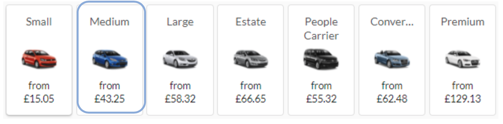

# Car Category Filters

In order to correctly filter the provided car categories by supplier it is recommended to use the acriss code of every car group. ACRISS is an industry standard vehicle matrix to define car models ensuring a like to like comparison of vehicles. This easy-to-use matrix consists of four categories. Each position in the four character vehicle code represents a definable characteristic of the vehicle. The expanded vehicle matrix makes it possible to have 400 vehicle types. Car codes are created by assigning one character from each column and combining them into a four-character car code:

## ACRISS Code Map


| Category             | Type                   | Transmission/Drive         | Fuel/Air cond.                       | 
|----------------------|------------------------|----------------------------|--------------------------------------| 
| M Mini               | B 2-3 Door             | M Manual Unspecified Drive | R Unspecified Fuel/Power With Air    | 
| N Mini Elite         | C 2/4 Door             | N Manual 4WD               | N Unspecified Fuel/Power Without Air | 
| E Economy            | D 4-5 Door             | C Manual AWD               | D Diesel Air                         | 
| H Economy Elite      | W Wagon/Estate         | A Auto Unspecified Drive   | Q Diesel No Air                      | 
| C Compact            | V Passenger Van        | B Auto 4WD                 | H Hybrid Air                         | 
| D Compact Elite      | L Limousine            | D Auto AWD                 | I Hybrid No Air                      | 
| I Intermediate       | S Sport                |                            | E Electric Air                       | 
| J Intermediate Elite | T Convertible          |                            | C Electric No Air                    | 
| S Standard           | F SUV                  |                            | L LPG/Compressed Gas Air             | 
| R Standard Elite     | J Open Air All Terrain |                            | S LPG/Compressed Gas No Air          | 
| F Fullsize           | X Special              |                            | A Hydrogen Air                       | 
| G Fullsize Elite     | P Pick up Regular Car  |                            | B Hydrogen No Air                    | 
| P Premium            | Q Pick up Extended Car |                            | M Multi Fuel/Power Air               | 
| U Premium Elite      | Z Special Offer Car    |                            | F Multi fuel/power No Air            | 
| L Luxury             | E Coupe                |                            | V Petrol Air                         | 
| W Luxury Elite       | M Monospace            |                            | Z Petrol No Air                      | 
| O Oversize           | R Recreational Vehicle |                            | U Ethanol Air                        | 
| X Special            | H Motor Home           |                            | X Ethanol No Air                     | 
|                      | Y 2 Wheel Vehicle      |                            |                                      | 
|                      | N Roadster             |                            |                                      | 
|                      | G Crossover            |                            |                                      | 
|                      | K Commercial Van/Truck |                            |                                      | 


Find out more about the ACRISS code at <http://www.acriss.org> and <https://en.wikipedia.org/wiki/ACRISS_Car_Classification_Code>.


In the Carnect OTA API Integration Documentation the ACRISS code is sent with every car rental offer in the getVehAvailRate Response (please compare example below):


```xml
<VehAvailCore Status="Available">
    <Vehicle AirConditionInd="true" TransmissionType="Manual" FuelType="Petrol" DriveType="Unspecified" PassengerQuantity="5" BaggageQuantity="0" VendorCarType="B" Code="Seat Ibiza" CodeContext="">
        <VehType VehicleCategory="1" DoorCount="4" />
               <VehClass Size="3" />
                   <VehMakeModel Name="Seat Ibiza" Code="EDMR" />
                   <PictureURL>https://static.carhire-solutions.com/images/car/Avis/small/es0_b_lrg01.jpg</PictureURL>
                     </Vehicle>


```

For the clear overview of different categories Carnect has decided for 7 different car groups which are displayed on its own B2C sites:


## Car groups
Please find below the explanation of how the acriss codes are correctly mapped to the above car groups.


### Small


Filtered categories:

* Mini (M)
* Mini Elite (N)
* Economy (E)
* Economy Elite (H)


### Medium


Filtered categories:

* Compact (C)
* Compact Elite (D)


### Large


Filtered categories:

* Intermediate (I)
* Intermediate Elite (J)
* Standard (S)
* Standard Elite (R)
* Fullsize (F)
* Fullsize Elite (G)


### Estate


Filtered categories:

* Wagon/Estate (W)

### People Carrier


Filtered categories:

* Oversize (O)

and filtered Types:

* Passenger Van (V)


### Convertible


Filtered categories:

* Convertible (T)


### Premium


Filtered categories:

* Premium (P)
* Premium Elite (U)
* Luxury (L)
* Luxury Elite (W)
* Special (X)
